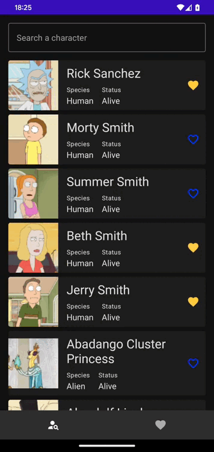

# Rick and Morty characters application

This is a simple application that shows the characters of the Rick and Morty series.

It uses the [Rick and Morty API](https://rickandmortyapi.com/) to get the data.

## Architecture

This project is based on the Clean Architecture, which is a way to organize the code in layers, each
one with its own responsibilities. The main idea is to separate the business logic from the
framework and the UI. This way, the business logic can be tested without the need of a UI or a
framework. 

The UI layer is build with the MVI pattern. This pattern is based on the unidirectional data flow,
where the data only flows in one direction. 

## Libraries

This project uses the following libraries:
- [Kotlin](https://kotlinlang.org/)
- [RxJava](https://github.com/ReactiveX/RxJava)
- [Hilt](https://dagger.dev/hilt/)
- [Jetpack](https://developer.android.com/jetpack)
- [Compose](https://developer.android.com/jetpack/compose)
- [Room](https://developer.android.com/jetpack/androidx/releases/room)
- [Retrofit](https://square.github.io/retrofit/)

